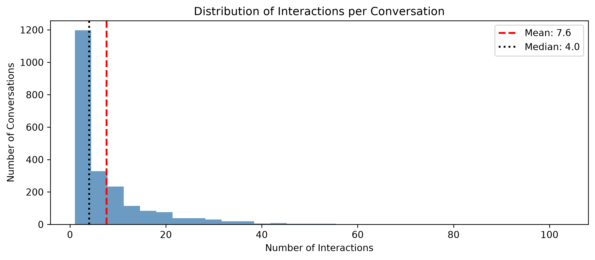
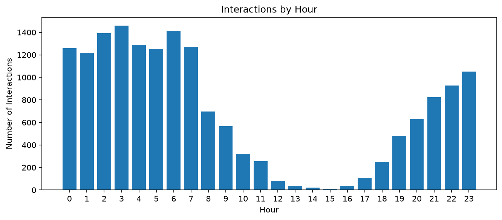
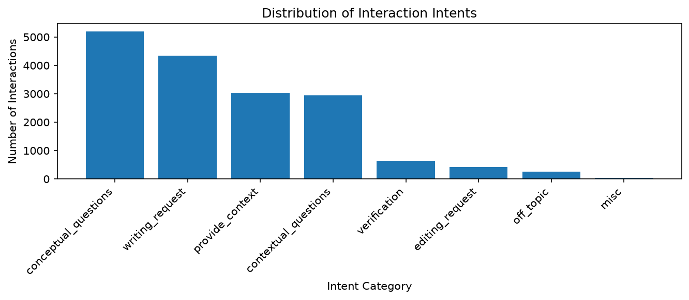

# 분석 보고서

## Executive Summary

본 분석은 StudyChat 데이터를 활용하여 사용자가 AI Assistant를 어떤 방식으로 이용하는지 파악하고,
지속적인 사용과 함께 나타나는 행동 특성을 확인하는 것을 목적으로 한다.

전체 데이터는 203명의 사용자, 2,214개의 Conversation,
16,851개의 관측 Interaction으로 구성되어 있다.

현재까지 분석에서 확인한 주요 결과는 다음과 같다.

### 1. 원본 Interaction 횟수 관련 메타데이터에 불일치가 존재한다

원본 데이터의 `interactionCount`와 `chatTotalInteractionCount`를 실제 관측된 Interaction 수와 비교한 결과,
일부 Conversation에서 Interaction 순번의 공백과 전체 Interaction 수의 불일치가 확인되었다.

이에 따라 분석에서는 원본 Interaction 횟수를 그대로 사용하지 않고,
각 `chatId`에서 실제로 관측된 행을 기준으로 `observed_interaction_index`와
`observed_interaction_count`를 다시 정의하였다.

이후 Conversation 길이와 Multi-turn 여부 역시 관측된 Interaction을 기준으로 분석하였다.

### 2. 대부분의 Conversation은 한 날짜 안에서 10회 이내의 Interaction으로 진행된다

전체 Conversation의 약 80%는 한 날짜 안에서 사용되었으며,
Conversation별 관측 Interaction 수의 P75는 10회이다.

즉 사용자는 하나의 Conversation을 장기간 유지하기보다,
특정 시점에 필요한 작업이나 질문을 중심으로 여러 차례 Interaction을 이어간 뒤
해당 Conversation의 사용을 마무리하는 패턴을 보인다.

대화당 관측 Interaction 수의 중앙값은 4회로,
한 번의 질문만 사용하는 경우보다 몇 차례 후속 질문을 이어가는 방식이 일반적으로 나타난다.

### 3. Interaction은 특정 시간대에 집중되는 패턴을 보인다

원본 기록 시각을 기준으로 Interaction 수를 비교하면
0~7시 구간에서 높은 이용량이 나타나고,
12~16시 구간에서는 이용량이 크게 감소한다.
이후 17시부터 다시 이용량이 증가하는 패턴이 나타난다.

시간대별 사용량이 뚜렷하게 구분된다는 점은
사용자가 하루 동안 일정한 빈도로 AI Assistant를 이용하기보다
특정 시간대에 집중적으로 사용하는 패턴을 가지고 있음을 보여준다.

다만 원본 timestamp의 timezone 기준에 따라 실제 사용자의 현지 시각과 차이가 발생할 수 있으므로,
시간대별 행동은 timezone을 반영한 추가 검증을 통해 구체화한다.

### 4. 일회성 사용자는 첫 Prompt에 더 많은 정보를 입력하는 경향을 보인다

관측 기간 중 한 날짜에서만 활동한 사용자를 One-day User,
서로 다른 날짜에 2일 이상 활동한 사용자를 Returning User로 정의하여 첫 이용 행동을 비교하였다.

첫 Prompt 길이의 평균은 One-day User가 약 5,336자,
Returning User가 약 909자로,
일회성 사용자의 첫 Prompt가 약 6배 길게 나타났다.

중앙값 역시 One-day User 2,425자,
Returning User 230자로 차이가 크게 나타났다.

또한 One-day User에서는 첫 요청이 작성 요청으로 분류된 사용자의 비중이 높게 나타났다.
이는 일회성 사용자가 비교적 많은 정보나 작업 내용을 한 번에 전달하고
특정 과업을 중심으로 AI Assistant를 이용하는 사용자군일 가능성을 보여준다.

## Metric Definition

본 분석에서는 원본 데이터를 Interaction, Conversation, User 단위로 구분하고,
Q1의 전체 사용 패턴과 Q2의 지속 사용자 비교에 필요한 지표를 정의하였다.

### Observed Interaction Count

하나의 Conversation에서 현재 데이터에 실제로 관측된 Interaction 수.

원본 `chatTotalInteractionCount`와 실제 관측 행 수 사이에 일부 불일치가 확인되어,
Conversation의 길이는 `chatId`별 실제 관측 행 수를 기준으로 계산하였다.

이 지표는 대화당 Interaction 수의 분포와
Conversation이 어느 정도의 상호작용을 거쳐 마무리되는지를 확인하는 데 사용한다.

### Conversation Active Days

하나의 Conversation에서 하나 이상의 Interaction이 발생한 고유 날짜 수.

이를 통해 하나의 Conversation이 같은 날짜 안에서 사용되는지,
여러 날짜에 걸쳐 이어지는지를 확인한다.

- Single-day Conversation: Active Days = 1
- Multi-day Conversation: Active Days >= 2

### Multi-turn Conversation

하나의 Conversation에서 관측된 Interaction 수가 2회 이상인 경우를 Multi-turn으로 정의한다.

- Single-turn Conversation: Observed Interaction Count = 1
- Multi-turn Conversation: Observed Interaction Count >= 2

사용자가 하나의 질문만 남기는지,
같은 Conversation에서 여러 차례 질문과 응답을 이어가는지를 확인하기 위한 지표이다.

### User Active Days

한 사용자가 하나 이상의 Interaction을 발생시킨 고유 날짜 수.

하루(day) 는 Interaction의 `timestamp`에서 추출한
calendar date를 기준으로 정의한다.

Q2에서는 이 값을 기준으로 사용자를 두 그룹으로 구분한다.

- One-day User: Active Days = 1
- Returning User: Active Days >= 2

이를 통해 한 날짜에만 서비스를 이용한 사용자와
여러 날짜에 걸쳐 서비스를 이용한 사용자의 행동을 비교한다.

### First-day Interaction Count

사용자의 첫 활동일에 발생한 전체 Interaction 수.

서비스를 처음 이용한 날 사용자가 어느 정도의 상호작용을 수행했는지를 나타내며,
One-day User와 Returning User의 초기 사용량을 비교하는 데 사용한다.

### First Conversation Interaction Count

사용자가 처음 생성한 Conversation에서 관측된 전체 Interaction 수.

첫 이용 시 사용자가 하나의 Conversation을 얼마나 이어서 사용하는지 확인하기 위한 지표이다.

### First Prompt Length

사용자의 첫 관측 Prompt의 문자 수.

사용자가 처음 AI Assistant를 이용할 때
얼마나 많은 정보나 내용을 한 번에 입력하는지를 비교하기 위해 사용한다.

Q2에서는 One-day User와 Returning User의 첫 Prompt 길이를 비교한다.

### Days to Second Active Day

Returning User의 첫 활동일과 두 번째 활동일 사이의 날짜 차이.

사용자가 첫 이용 이후 얼마 만에 다시 서비스를 이용했는지를 나타내는 지표이다.

## Findings

### Q1. 사용자는 AI Assistant를 어떻게 사용하고 있는가?

원본 데이터의 `interactionCount`와 `chatTotalInteractionCount`를 실제 관측된 Interaction 수와 비교한 결과, 일부 Conversation에서 순번 공백과 전체 Interaction 수의 불일치가 확인되었다. 따라서 Conversation 길이와 Multi-turn 여부는 원본 메타데이터가 아니라 `chatId`별 실제 관측 행 수를 기준으로 재계산하였다.

관측 기준으로 대화당 Interaction 수의 중앙값은 4회, P75는 10회이며, Conversation Active Days의 P75는 1일이다. 또한 전체 Conversation의 78%가 Multi-turn이지만 Multi-day Conversation은 20.01%로 나타났다. 즉 사용자는 하나의 Conversation을 여러 날 장기간 유지하기보다, 한 날짜 안에서 몇 차례 후속 질문을 이어가며 과업을 마무리하는 패턴을 주로 보인다. 기록 시각 기준으로는 0~7시에 이용량이 높고 12~16시에 낮아지는 시간대별 집중 패턴도 나타났으며, 해당 결과는 timezone 기준을 반영해 추가 확인할 필요가 있다. 

### Q2. 지속 사용자와 일회성 사용자는 어떤 차이가 있는가?

서로 다른 날짜에 2일 이상 활동한 사용자를 Returning User, 한 날짜에서만 활동한 사용자를 One-day User로 정의하였다. 전체 203명 중 Returning User는 190명(93.6%), One-day User는 13명(6.4%)이다. 두 그룹의 첫 대화 Interaction 수 중앙값은 모두 3회였고, 첫날 Interaction 수에서도 뚜렷하게 한 방향으로 차이가 나타나지는 않았다. 따라서 지속 사용 여부는 단순히 첫날 더 많은 Interaction을 수행했는지보다 초기 요청의 형태에서 차이를 확인할 필요가 있다.

가장 큰 차이는 첫 Prompt 길이에서 나타났다. One-day User의 첫 Prompt 평균 길이는 약 5,336자로 Returning User의 약 909자보다 약 5.9배 길었으며, 중앙값도 각각 2,425자와 230자로 큰 차이를 보였다. 또한 One-day User 13명 중 8명의 첫 요청이 `writing_request`로 분류되어, 지속 사용자보다 긴 입력과 작성 중심 요청으로 이용을 시작하는 패턴이 두드러졌다. 이는 일회성 사용자가 비교적 많은 정보나 작업 내용을 한 번에 제공하며 특정 과업 중심으로 AI Assistant를 이용할 가능성을 보여주는 관찰이다. 

## Visualizations

### Fig 1. Distribution of Interactions per Conversation

대화당 관측 Interaction 수의 중앙값은 4회이며,
전체 Conversation의 75%는 10회 이하의 Interaction을 가진다.

### Fig 2. Interactions by Hour

Interaction은 하루 동안 균등하게 발생하지 않고 특정 시간대에 집중되는 패턴을 보인다.
기록 시각 기준으로는 0~7시에 이용량이 높고 12~16시에 낮게 나타난다.
시간대 해석은 원본 timestamp의 timezone 기준을 함께 고려한다.

### Fig 3. Intent Distribution

전체 Interaction에서는 개념 질문과 작성 요청이 높은 비중을 차지한다.
사용자는 정보 탐색과 작성 작업을 중심으로 AI Assistant를 활용하는 패턴을 보인다.

## Recommendations
-
## Limitations
- **One-day User의 표본 크기가 작다.**  
  전체 203명 중 One-day User는 13명으로,
  Returning User 190명과 비교했을 때 그룹 간 표본 크기 차이가 크다.
  특히 Intent와 같은 범주형 변수의 비율은 소수 사용자의 행동에 크게 영향을 받을 수 있다.

- **`llm_label`은 실제 사용자 의도의 정답이 아니다.**  
  Intent 분석에 사용한 `llm_label`은 LLM이 생성한 분류 결과이므로,
  실제 사용자의 목적과 일부 차이가 존재할 수 있다.
  따라서 Intent는 사용자 행동을 설명하기 위한 보조 변수로 사용한다.

- **관찰된 차이를 인과관계로 해석할 수 없다.**  
  예를 들어 One-day User의 첫 Prompt가 더 길게 나타났지만,
  긴 Prompt가 일회성 사용을 발생시켰다고 판단할 수는 없다.
  본 분석은 사용자 행동 간의 차이와 함께 나타나는 패턴을 확인하는 데 초점을 둔다.

- **시간대별 이용 패턴은 timestamp의 timezone 기준에 영향을 받는다.**  
  현재 시간대 분석은 원본 timestamp에서 추출한 hour 값을 기준으로 한다.
  실제 사용자의 현지 시간과 차이가 있을 수 있으므로,
  timezone 기준을 확인한 뒤 시간대별 행동을 다시 검증할 필요가 있다.